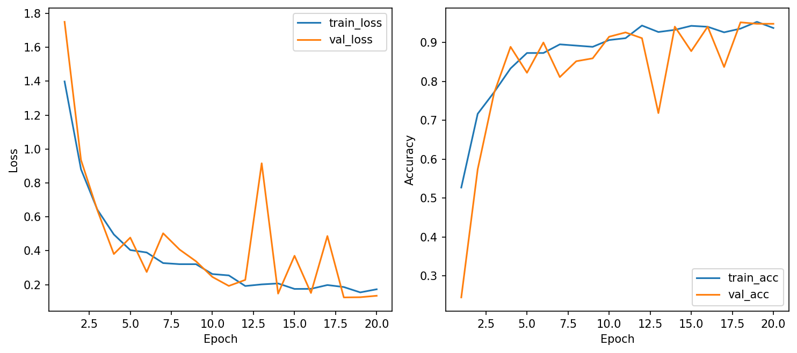
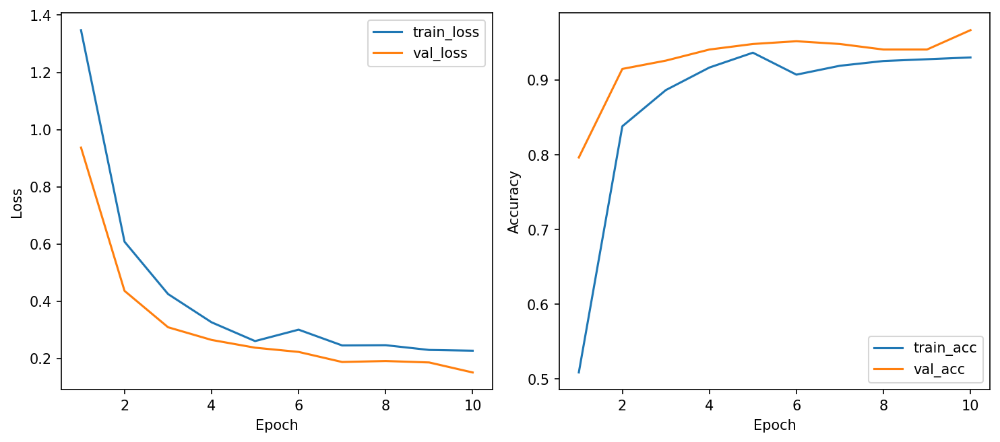
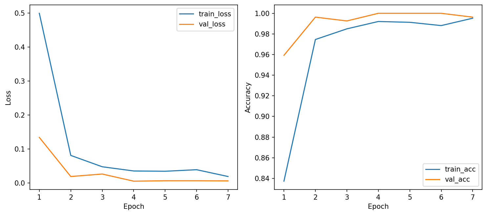
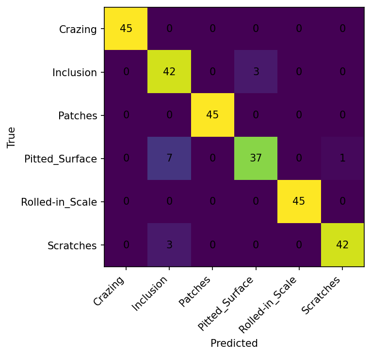
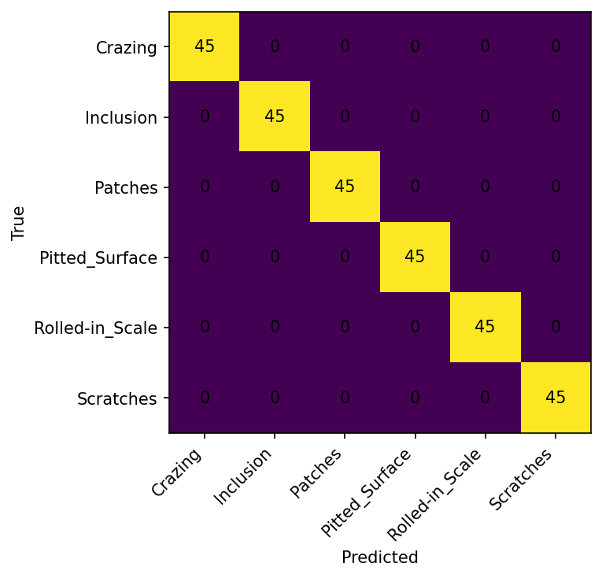

# CSC4005 – Lab 2 Report

## 1. Thông tin chung

- W&B project: https://wandb.ai/mmmi/csc4005-lab2-neu-cnn

## 2. Bài toán

### Mục tiêu
Huấn luyện một mô hình để tự động nhận diện và phân loại các loại lỗi bề mặt trên thép tấm cán nóng.

### Dữ liệu
Tập dữ liệu bao gồm 1.800 ảnh xám (grayscale), chia đều cho 6 loại khuyết tật phổ biến:

- Crazing (Rạn nứt)

- Inclusion (Tạp chất)

- Patches (Vết bẩn/Vết dán)

- Pitted Surface (Bề mặt rỗ)

- Rolled-in Scale (Vảy cán)

- Scratches (Vết trầy xước)

## 3. Mô hình và cấu hình
### 3.1. MLP baseline từ Lab 1
- Cấu hình:  optimizer adamw, learning rate 0.001, weight_decay 0.0001, dropout 0.3, epochs 20, batch size 32, img size 64, patience 5, dùng augment   

Chỉ số |	 Baseline (AdamW) 
---------  | --------- 
Best Val Accuracy |	41.85% 	
Test Accuracy |	38.15%
Best Val Loss |	1.4993
Test Loss |	1.4957 

### 3.2. CNN from scratch
- Cấu hình:  train mode scratch, optimizer adamw, learning rate 0.001, weight_decay 0.0001, dropout 0.3, epochs 20, batch size 32, img size 64, patience 5, dùng augment 
### 3.3. Transfer learning
- Cấu hình:  train mode transfer, optimizer adamw, learning rate 0.001, weight_decay 0.0001, dropout 0.3, epochs 10, batch size 32, img size 128, patience 3, dùng augment 
### 3.4. Finetune learning
- Cấu hình:  train mode transfer, optimizer adamw, learning rate 0.0001, weight_decay 0.0001, dropout 0.3, epochs 10, batch size 32, img size 128, patience 3, dùng augment 
## 4. Bảng kết quả
| Model | Train mode | Best Val Acc | Test Acc | Epoch time | Trainable Params | Nhận xét |
|---|---|---:|---:|---:|---:|---|
| MLP | scratch | 0.4185 | 0.3815 | 6.60 sec |  | Hiệu năng thấp: Cấu trúc MLP không phù hợp với dữ liệu hình ảnh (bị mất thông tin không gian). Độ chính xác thấp (~38%) cho thấy mô hình không học được các đặc trưng phức tạp của lỗi bề mặt. |
| CNN-small | scratch | 0.9519 | 0.9481 | 6.40 sec | 32,614 | Hiệu quả vượt trội: Dù số lượng tham số rất nhỏ (32k), CNN đạt kết quả cực tốt (~95%). Điều này chứng minh sức mạnh của lớp tích chập trong việc trích xuất đặc trưng hình học đặc thù của NEU-CLS. |
| ResNet18 | transfer | 0.9667 | 0.9630 | 32.77 sec | 3,078 | Ổn định & Nhanh: Chỉ huấn luyện lớp Classifier (FC) cuối cùng nên thời gian mỗi epoch nhanh hơn finetune. Kết quả rất cao (~96%) nhờ tận dụng bộ đặc trưng mạnh mẽ từ ImageNet. |
| ResNet18 | finetune | 1.0000 | 1.0000 | 52.50 sec |  11,179,590 | Hoàn hảo (SOTA): Đạt độ chính xác tuyệt đối (100%). Việc cho phép cập nhật toàn bộ tham số giúp mô hình thích nghi hoàn toàn với các chi tiết nhỏ nhất của dữ liệu thép tấm. Đổi lại, thời gian huấn luyện và số tham số cần cập nhật là lớn nhất. |
## 5. Phân tích learning curves
### 5.1. CNN-small (Scratch)

- Tốc độ hội tụ: Mô hình bắt đầu với val_acc khá thấp (24.44% ở Epoch 1) nhưng tăng vọt lên 77.04% chỉ sau 3 epoch. Điều này cho thấy kiến trúc CNN rất nhạy bén với các đặc trưng hình học của lỗi bề mặt thép ngay cả khi huấn luyện từ đầu.

- Độ ổn định: Đường cong có dấu hiệu biến động (oscillations). Tại Epoch 13, val_loss tăng đột biến lên 0.9158 trong khi train_loss vẫn thấp (0.2013). Đây là dấu hiệu của việc mô hình bị rơi vào các vùng cực tiểu cục bộ hoặc dữ liệu augmentation tại epoch đó tạo ra các mẫu thử thách.

- Hiệu quả của Learning Rate (LR) Scheduler: Sau khi giảm LR xuống 0.0005 (Epoch 9) và 0.00025 (Epoch 17), đường cong ổn định dần và đạt đỉnh val_acc 95.19% ở Epoch 18.

### 5.2. ResNet18 (Transfer Learning - Feature Extraction)

- Đặc điểm khởi đầu: Khác với CNN-small, ResNet18 bắt đầu ở vị trí rất thuận lợi nhờ bộ trọng số ImageNet. Ngay Epoch 1, val_acc đã đạt gần 80%.

- Xu hướng học tập: Đường cong học tập rất mượt mà và ít biến động hơn hẳn so với mô hình scratch. Khoảng cách (gap) giữa train_acc (93.02%) và val_acc (96.67%) ở cuối quá trình cho thấy mô hình tổng quát hóa cực tốt trên tập dữ liệu này.

- Nhận xét: Việc chỉ huấn luyện lớp Classifier giúp mô hình tập trung vào việc phân loại các đặc trưng đã được trích xuất sẵn, giúp tiết kiệm thời gian (ổn định ở mức ~18s/epoch).

### 5.3. ResNet18 (Finetuning)

- Sức mạnh tuyệt đối: Đây là đường cong học tập lý tưởng nhất. Chỉ sau 2 epoch, mô hình đã đạt val_acc 99.63%. Đến Epoch 4, mô hình chạm mốc tuyệt đối 100%.

- Loss Curve: Giá trị val_loss cực thấp (0.0050 ở Epoch 4), cho thấy mô hình cực kỳ tự tin vào các quyết định phân loại của mình.

- Cơ chế Early Stopping: Hệ thống đã kích hoạt dừng sớm ở Epoch 7 khi nhận thấy val_loss bắt đầu đi ngang hoặc có xu hướng tăng nhẹ (từ 0.0050 lên 0.0058), giúp ngăn chặn hiện tượng Overfitting và tiết kiệm tài nguyên tính toán (do mỗi epoch của Finetune tốn tới ~50-90s).

### Tóm tắt so sánh chung
- Về độ ổn định: ResNet18 (Transfer) > ResNet18 (Finetune) > CNN-small.

- Về khả năng tối ưu hóa: Finetune cho kết quả tốt nhất nhưng đánh đổi bằng thời gian huấn luyện lâu nhất trên mỗi epoch.

- Về tính thực tế: CNN-small tuy có biến động nhưng với độ chính xác ~95% và thời gian chạy cực nhanh (~4s/epoch), đây là mô hình có tiềm năng ứng dụng thời gian thực cao nhất.
## 6. Confusion matrix và lỗi dự đoán sai
### 5.1. CNN-small (Scratch)

Đây là mô hình có nhiều sự nhầm lẫn nhất, tập trung chủ yếu vào mối quan hệ giữa hai lớp: Inclusion và Pitted_Surface.

Lỗi nghiêm trọng nhất: 7 mẫu thuộc lớp Pitted_Surface bị dự đoán nhầm thành Inclusion.

Nhận xét: Sự nhầm lẫn hai chiều giữa Inclusion và Pitted_Surface (tổng cộng 10 mẫu lỗi qua lại) cho thấy các đặc trưng điểm ảnh của hai loại lỗi này trong mắt mô hình nhỏ là khá tương đồng. Tuy nhiên, mô hình nhận diện tuyệt đối chính xác (45/45) các lớp Crazing, Patches và Rolled-in_Scale.
### 5.2. ResNet18 (Transfer Learning - Feature Extraction)

Mô hình này cải thiện đáng kể khả năng phân biệt so với CNN-small nhưng vẫn gặp khó khăn ở một vài vị trí:

- Lỗi chính: 5 mẫu Inclusion bị dự đoán nhầm sang Pitted_Surface.

- Lỗi nhỏ: Có sự nhầm lẫn nhẹ giữa Crazing và Patches (2 mẫu).

Nhận xét: Việc sử dụng đặc trưng từ ImageNet giúp ResNet18 tách biệt tốt các lớp khó như Pitted_Surface (đạt 45/45), nhưng lớp Inclusion vẫn là "điểm yếu" khi bị dự đoán sai tổng cộng 7 mẫu.
### 5.3. ResNet18 (Finetuning)

Kết quả: Đạt ma trận đường chéo hoàn hảo.

Nhận xét: Không có bất kỳ lỗi dự đoán sai nào (45/45 cho cả 6 lớp). Việc cho phép cập nhật toàn bộ trọng số mạng giúp mô hình học được những sự khác biệt tinh vi nhất giữa Inclusion và Pitted_Surface mà các phương pháp trước đó bỏ lỡ.

## 7. Kết luận
- CNN có cải thiện so với MLP không?
Có, và sự cải thiện là cực kỳ đột phá.

Về độ chính xác: MLP chỉ đạt khoảng 38%, trong khi ngay cả một mạng CNN nhỏ (CNN-small) cũng đã đạt tới 95%.

Về bản chất: MLP thất bại vì nó "phẳng hóa" ảnh, làm mất đi mối quan hệ không gian giữa các pixel. Ngược lại, các lớp tích chập (Convolutional Layers) của CNN có khả năng trích xuất các đặc trưng hình học như cạnh, góc và kết cấu (texture) — những yếu tố then chốt để phân biệt 6 loại khuyết tật thép.
- Transfer learning có tốt hơn không?
Có, Transfer Learning mang lại hiệu quả vượt trội về cả độ chính xác lẫn tính ổn định.

Độ chính xác: Chuyển từ CNN tự xây dựng (95%) lên ResNet18 (96% - 100%).

Khả năng hội tụ: Như đã phân tích ở biểu đồ học tập, ResNet18 bắt đầu từ một vị trí rất cao (80%) và đường cong loss rất mịn, ít biến động hơn so với việc huấn luyện từ đầu (scratch). Điều này là nhờ mô hình đã có sẵn "kiến thức" về các dạng hình khối từ bộ dữ liệu khổng lồ ImageNet.

- Khi nào nên chọn transfer learning thay vì train from scratch?

| Tiêu chí | Nên chọn Transfer Learning khi... | Nên chọn Train from scratch khi... 
|---|---|---
| Dữ liệu | Tập dữ liệu nhỏ hoặc trung bình (như NEU-CLS). | Tập dữ liệu cực lớn và mang tính đặc thù rất cao (ví dụ: ảnh y khoa chuyên sâu).
| Thời gian | Cần mô hình hội tụ nhanh, tốn ít công sức thử nghiệm kiến trúc. | Có nhiều thời gian để tối ưu hóa kiến trúc riêng biệt.
| Phần cứng | Muốn tận dụng các đặc trưng mạnh mẽ mà không cần GPU quá khủng (nếu chỉ chạy Feature Extraction). | Muốn thiết kế mô hình siêu nhẹ (như CNN-small) để chạy trên thiết bị nhúng.
| Mục tiêu | Ưu tiên độ chính xác tối đa và sự ổn định (SOTA). | Ưu tiên kiểm soát hoàn toàn cấu trúc và số lượng tham số của mô hình.
